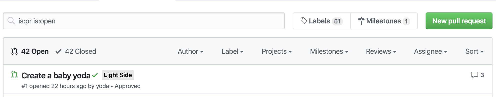

# Team Labeler Action 👥

[](https://github.com/JulienKode/team-labeler-action/actions)
[](https://github.com/JulienKode/team-labeler-action/actions)
[](https://github.com/JulienKode/team-labeler-action/issues)
[](https://github.com/JulienKode/team-labeler-action/network)
[](https://github.com/JulienKode/team-labeler-action/stargazers)
[](https://github.com/JulienKode/team-labeler-action/blob/master/LICENSE)
[](https://github.com/JulienKode/team-labeler-action/watchers)
[](https://twitter.com/intent/tweet?text=Checkout%20this%20library%20https%3A%2F%2Fgithub.com%2FJulienKode%2Fteam-labeler-action)

This repository provides a **GitHub action** to automatically **team label** on a **pull request** based author team.
This is useful if multiple team are working on the same project.



## Configuration

### Create `.github/teams.yml`

You need to provide a yml file that contains members of your teams:

```yaml
LightSide:
  - '@Yoda'
  - '@Luke'
  - '@RebelAlliance/jedi'

DarkSide:
  - '@DarkVador'
  - '@Palpatine'
```

## Usage

### Create `.github/workflows/team-labeler.yml`

Create a workflow (eg: `.github/workflows/team-labeler.yml` see [Creating a Workflow file](https://help.github.com/en/articles/configuring-a-workflow#creating-a-workflow-file)) to utilize the labeler action.
This action only needs the GITHUB_TOKEN secret as it interacts with the GitHub API to modify labels. If you want to create labels based on GitHub team memberships, the GITHUB_TOKEN should be a PAT that can read GitHub teams (`read:org`).
The action can be used as such:

```yaml
on: pull_request
name: team-label
jobs:
  team-labeler:
    runs-on: ubuntu-latest
    steps:
    - uses: JulienKode/team-labeler-action@v0.1.1
      with:
        repo-token: "${{ secrets.GITHUB_TOKEN }}"
```
